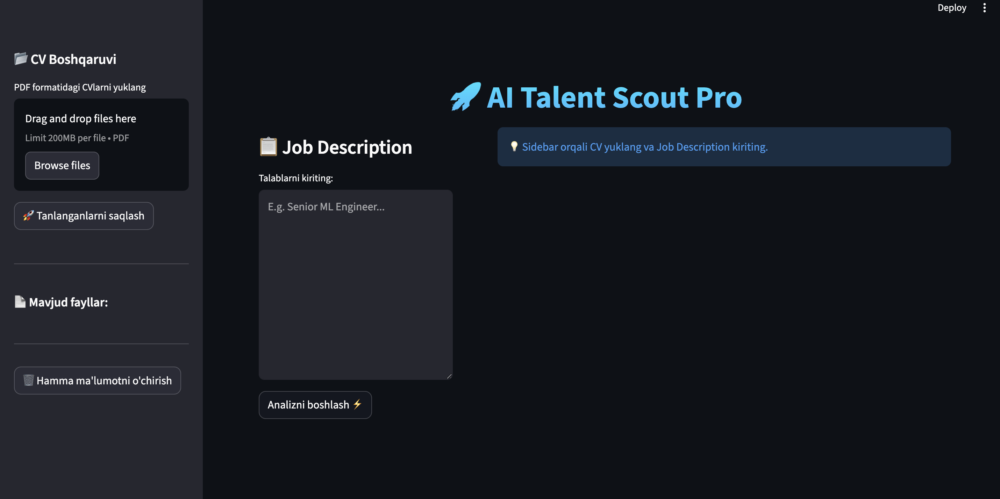
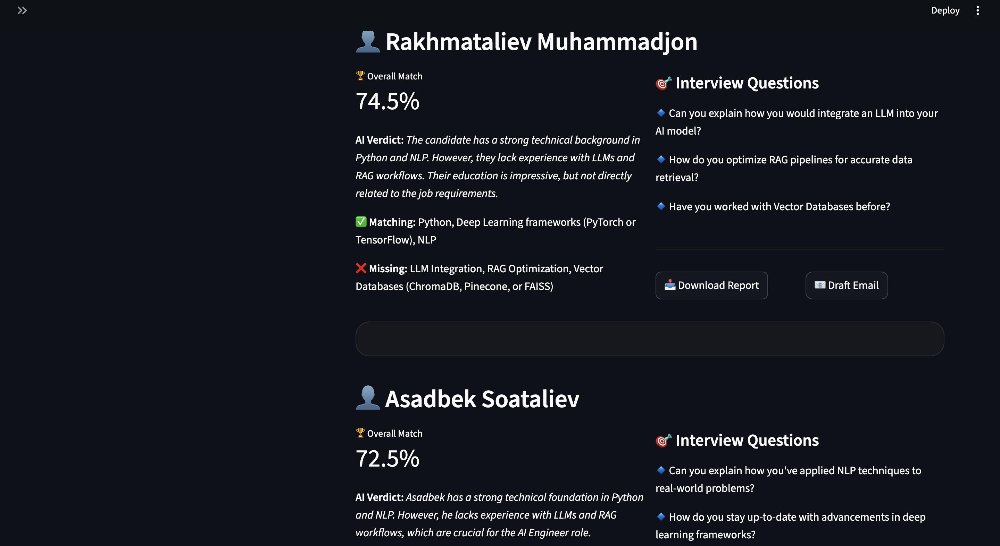
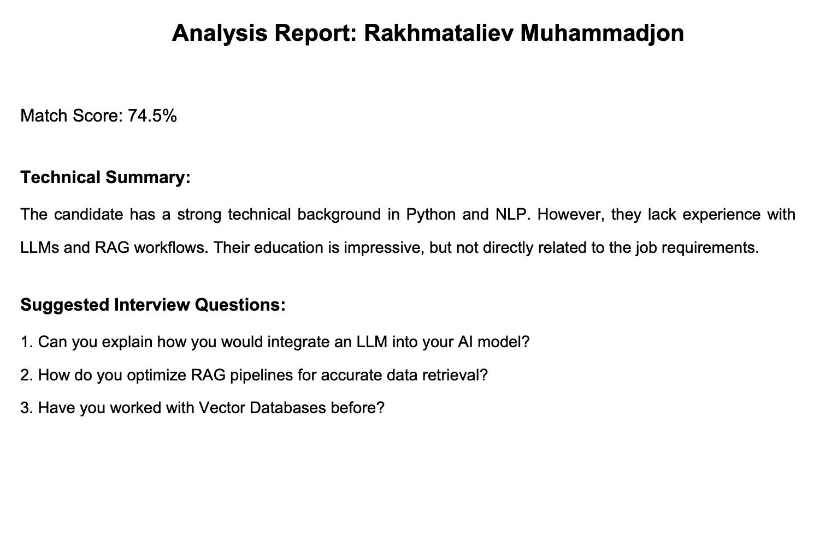

<p align="center">🚀 AI Talent Scout Pro</p>
<p align="center">     </p>

**AI Talent Scout Pro** is a cutting-edge, AI-powered Applicant Tracking System (ATS) designed to streamline the recruitment process. By leveraging **RAG (Retrieval-Augmented Generation)** and **Llama 3** models, it intelligently analyzes resumes against Job Descriptions (JD) to provide deep technical insights and rankings.


##✨ Advanced Features & Functionalities
###🔍 Hybrid Search Engine 
(Semantic + Keyword) Combines BM25 keyword search with ChromaDB Vector embeddings for high-precision retrieval. It finds candidates not just by specific words, but by the conceptual meaning of their experience.

###⚖️ Strict Weighted Scoring Algorithm
A rigorous evaluation system that assigns unique scores (0-100) based on weighted JD requirements (e.g., LLM mastery gets 40%, while soft skills get 10%). Includes decimal-point precision to eliminate ties between candidates.

###📊 Dynamic Skill Gap Analysis
Interactive Radar Charts visualize the mismatch between the job requirements and the candidate's profile. Quickly identify which technical areas a candidate needs to improve.

###🧠 Deep AI Verdict & Critique
Provides a 5-paragraph technical assessment for each candidate. The AI acts as a senior engineer, explaining why the candidate's specific past projects (like "Fraud Detection") make them a good fit for your current role.

###❓ Tailored Interview Question Generator
Generates 3-5 high-level technical questions uniquely customized for each candidate. If a candidate mentions "Kubernetes," the AI generates a scenario-based question specifically about their K8s experience.

###📧 Automated Context-Aware Outreach
Generates personalized interview invitations. Unlike generic templates, this AI mentions specific achievements from the candidate's CV, significantly increasing the candidate's response rate.

###📑 Multi-Format PDF Reporting
Generate and download professional executive summaries in PDF format. Perfect for sharing candidate evaluations with non-technical stakeholders or hiring managers.

###🛡️ 100% Local Privacy & Security Powered by Ollama
All resume processing and AI analysis happen locally on your hardware. No sensitive candidate data is ever uploaded to the cloud or used for external model training.

###📁 Intelligent CV Management & Indexing
Automated pipeline that cleans, splits, and indexes multi-page PDF resumes into a searchable vector database in seconds.

---

Visual Showcase
<div align="center"> <table> <tr> <td width="50%"><b>🖥 Dashboard Overview</b></td> <td width="50%"><b>🔍 Technical Analysis</b></td> </tr> <tr> <td></td> <td></td> </tr> <tr> <td width="50%"><b>📈 Skill Comparison</b></td> <td width="50%"><b>📄 Report Generation</b></td> </tr> <tr> <td></td> <td></td> </tr> </table> </div>
---

## 🛠 Tech Stack

* **Frontend:** [Streamlit](https://streamlit.io/)
* **AI Framework:** [LangChain](https://www.langchain.com/)
* **LLM:** [Ollama](https://ollama.com/) (Llama 3, Nomic-Embed-Text)
* **Vector Database:** [ChromaDB](https://www.trychroma.com/)
* **Data Visualization:** Plotly
* **Document Processing:** PyPDF2, LangChain DirectoryLoaders

---

## 🚀 Installation & Setup

### 1. Clone the Repository

git clone [https://github.com/MuhammadjonR/HR_Analysis_With_AI.git](https://github.com/MuhammadjonR/HR_Analysis_With_AI.git)
cd AI-Talent-Scout-Pro

### 2. Set Up Virtual Environment
```
Bash
python3 -m venv .venv
source .venv/bin/activate  # On Windows: .venv\Scripts\activate
```
### 3. Install Dependencies
```
Bash
pip install -r requirements.txt
```
### 4. Pull Required AI Models (Ollama)
```
Ensure you have Ollama installed and running:

Bash
ollama pull llama3
ollama pull nomic-embed-text
```
### 5. Run the Application
```
Bash
streamlit run main.py
```
💡 Usage Guide
Upload Resumes: Use the sidebar to upload candidate CVs in PDF format.

Indexing: Click "Save & Index" to build the vector database.

Define Requirements: Paste your Job Description into the main text area.

Analyze: Hit "Start AI Analysis" to receive ranked results, technical critiques, and interview questions.

🤝 Contributing
Contributions make the open-source community an amazing place to learn and create.

Fork the Project.

Create your Feature Branch (git checkout -b feature/AmazingFeature).

Commit your Changes (git commit -m 'Add some AmazingFeature').

Push to the Branch (git push origin feature/AmazingFeature).

Open a Pull Request.

### 📝 License
Distributed under the MIT License. See LICENSE for more information.

👨‍💻 Developer & Contact
<p align="center"> <b>Rakhmataliev Muhammadjon</b>


<a href="mailto:rakhmatalievm@gmail.com"></a> <a href="https://www.linkedin.com/in/muhammadjon-raxmataliyev-56381b236/"></a> </p>
